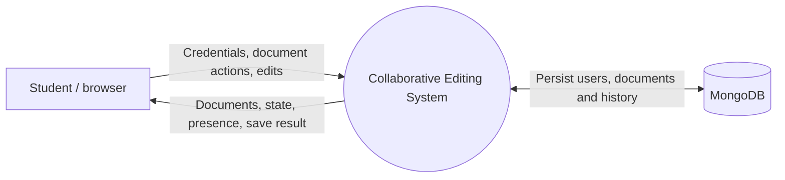
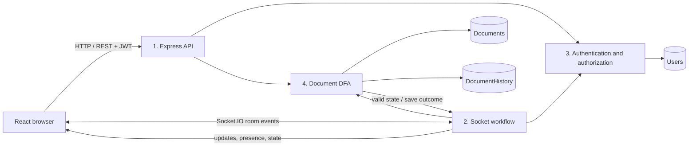

# Data flow diagrams

## Level 0

```mermaid
flowchart LR
  Student[Student / browser] -->|Credentials, document actions, edits| System((Collaborative Editing System))
  System -->|Documents, state, presence, save result| Student
  System <-->|Persist users, documents and history| DB[(MongoDB)]
```

## Level 1

```mermaid
flowchart LR
  B[React browser] -->|HTTP / REST + JWT| A[1. Express API]
  B <-->|Socket.IO room events| S[2. Socket workflow]
  A --> AU[3. Authentication and authorization]
  A --> DFA[4. Document DFA]
  S --> AU
  S --> DFA
  AU --> U[(Users)]
  DFA --> D[(Documents)]
  DFA --> H[(DocumentHistory)]
  DFA -->|valid state / save outcome| S
  S -->|updates, presence, state| B
```
