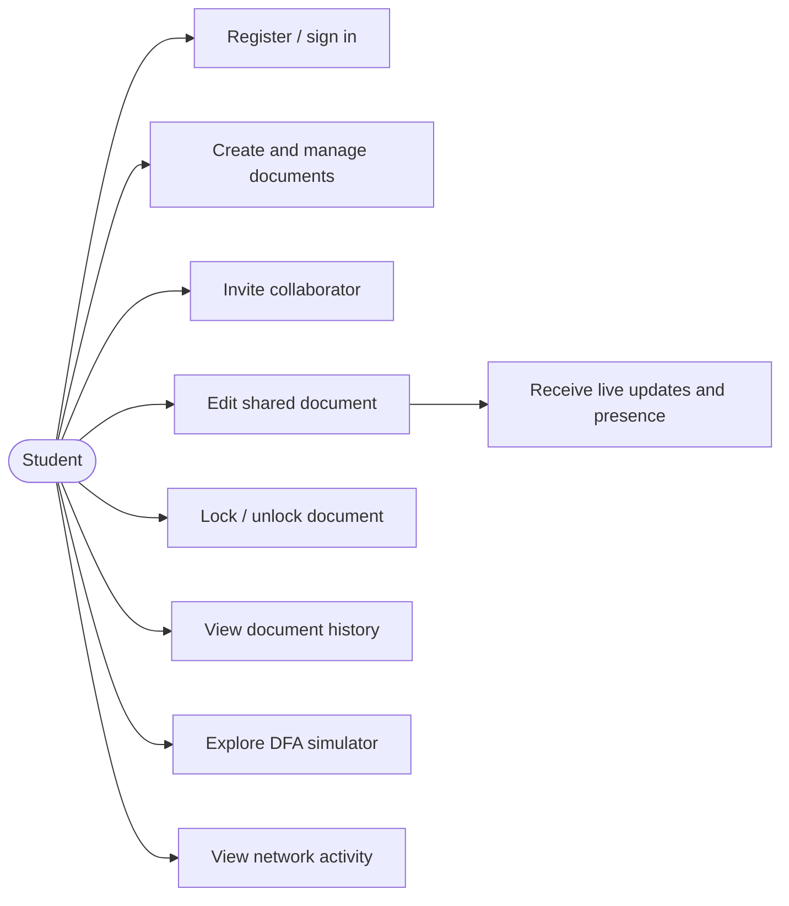

# Use case diagram

```mermaid
flowchart LR
  Student([Student])
  Student --> A[Register / sign in]
  Student --> B[Create and manage documents]
  Student --> C[Invite collaborator]
  Student --> D[Edit shared document]
  Student --> E[Lock / unlock document]
  Student --> F[View document history]
  Student --> G[Explore DFA simulator]
  Student --> H[View network activity]
  D --> I[Receive live updates and presence]
```
